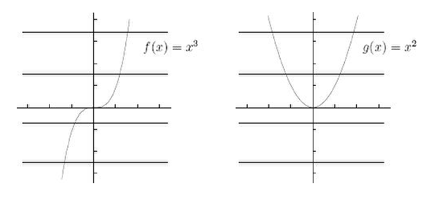
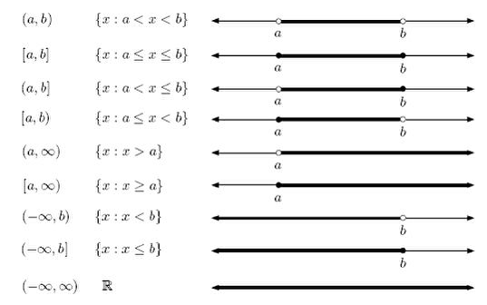
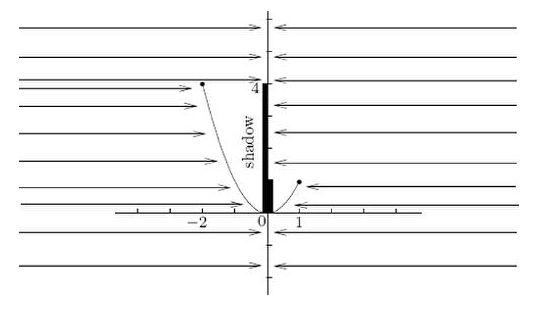

# Functions

[TOC]

## What is a "function"

$x \rightarrow f(x)$ ,f  is called a function

**a function must assign a unique output for each valid input **

### The horizontal line test

## Variables Domain Codomain Range

### Variables

- $x$ :Independent variable
- $y/f(x)$ : dependent variable

### Domain Codomain Range

- Domain: a set of inputs
- Codomain: a set  of **possible** outputs
- Range: a set of **actual** outputs

### *Interval notation

- closed: $[3, 5]$ 
- half-open: $(3,5], [3,5), [3, \infty) $
- open:$(3, 5), (-\infty, 5)$

### Finding the domain(p9e1, p16mc1, p17mc4)

- The denominator of a fraction can't be zero($tan(90^o)$)
- You can't take the square, forth, sixth root ( $x^{2n} ,n\in N$)of a negative number.
- You can't take the logarithm of a negative number or of $0$

### Finding the range(p19s2)

## Common Functions and Graphs(p22)

- Linear Functions
  - $y = mx + b$
- Polynomials
  - $f(x) = a_nx^n + a_{n-1}x^{n-1} + ...+a_1x + a_0 $
- Rotional functions
  - $\frac{p(x)}{q(x)}$
- Exponentials and logarithms
  - $y = n^x$
  - $y = log_a n$

- Trig functions
  - $sin(x), cos(x), tan(x) ...$

- Functions involving absolute values

## Inverse function

let $f(x) = y$, Starting with the output $y$, the **new function** finds the one and only input $x$ which leads to the output. The  **new function** is called the *inverse function* of f, and is written as $f^{-1}$.
$$
f(x) = y, f^{-1}(y) = x
$$
$domain \leftrightarrow range$       $ range \leftrightarrow domain$ 

undo button, black box

### finding the inverse function and restricting the domain(p13e6)

### Inverses of inverse functions(p20s7)

$$
f^{-1}(f(x)) = x  \\
f(f^{-1}(y)) = y
$$

domain and range!

## Composition(p19s5)

$$
k(x) = f(g(h(j(x))))\\
k = f\circ g\circ h \circ j
$$

## Odd/Even functions

Even functions: $f(x) = f(-x)$

Odd functions: $f(x) = - f(-x)$

with graphs:

prove:

Other properties

- Monotone
- Bounded
- Periodic

