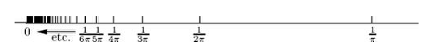
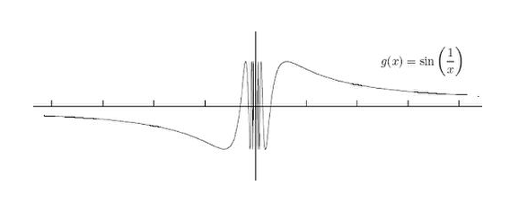

# Limits

[TOC]

## Large numbers and small numbers

$\lim_\limits{x\to\infty}f(x) = L$

## What is a limit 

### Let $f$ have domain $R/\{2\}$

$\lim_\limits{x\to 2}{f(x)} = 1$ or $f(x) \to 1$ as $x\to2  $

### Let $f$ have domain $R$ and $f(2)$ is exist

 

## Left-hand, right-hand, and two-sided limits

$\lim_\limits{x\to3^{-}}h(x) = 1$ and $\lim_\limits{x\to3^{+}}h(x) = -2$

$\lim_\limits{x\to3}h(x) = ?$

The regular 2-sided limit at $x =a$ exists **exactly when** both left-hand and right-hand limits at $x = a$ exist **and are equal to each other**

## Limits at $\infty $ and $-\infty$

### “vertical asymptote"

### $f(x) = sin(\frac{1}{x})$

sin2](sin2.png)

